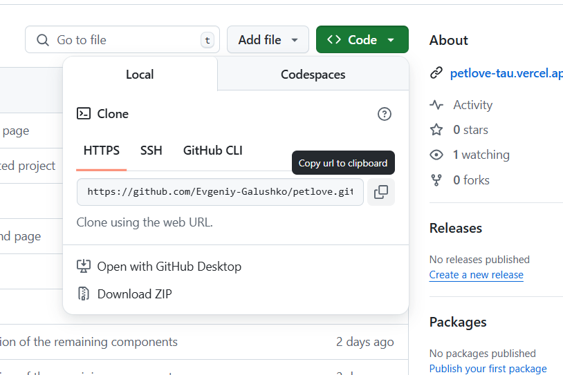
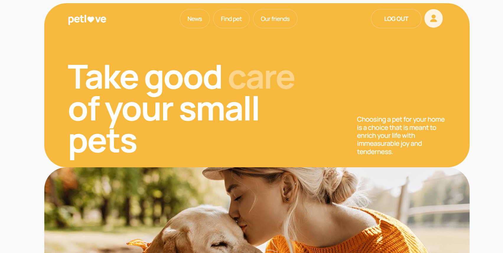
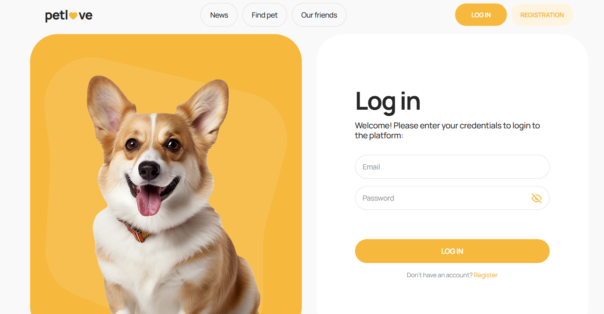
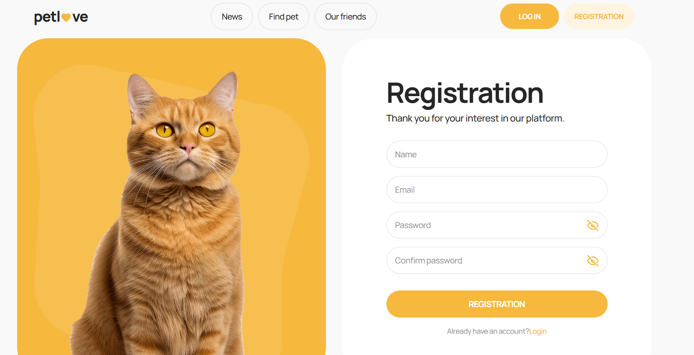
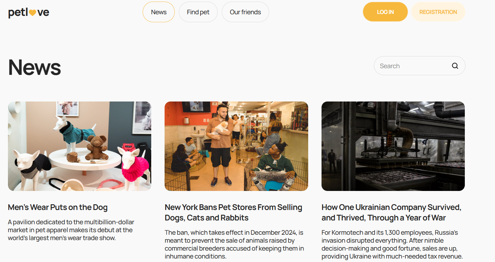
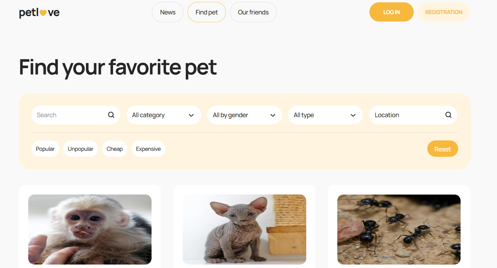
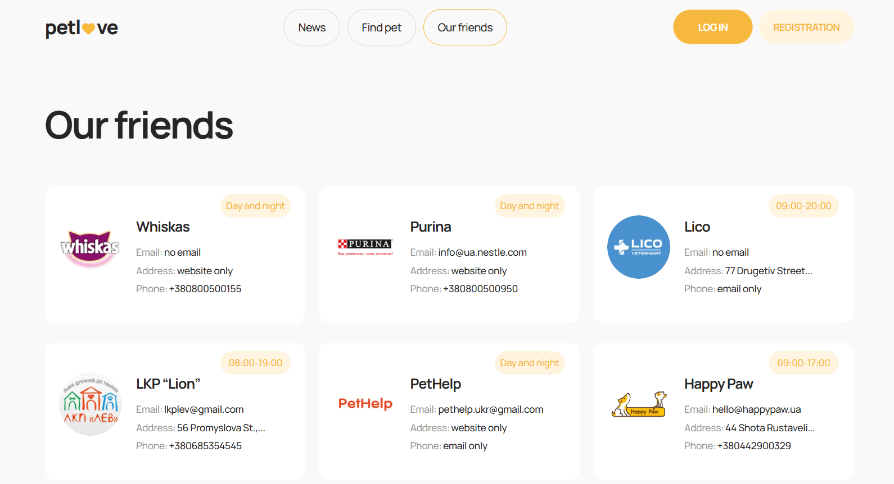
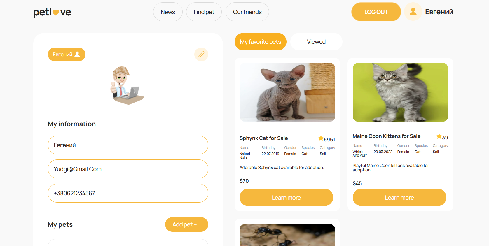
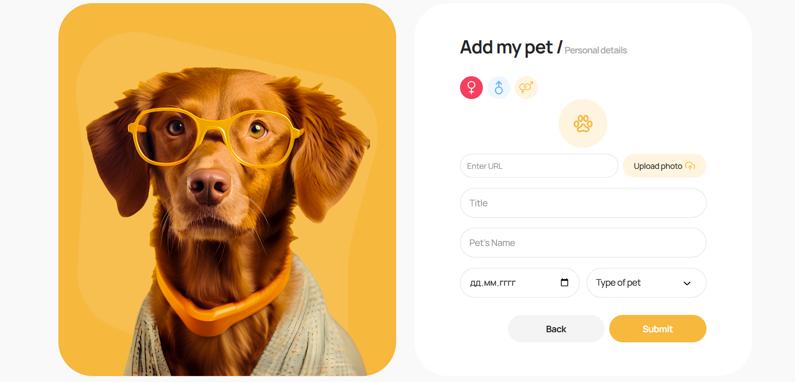
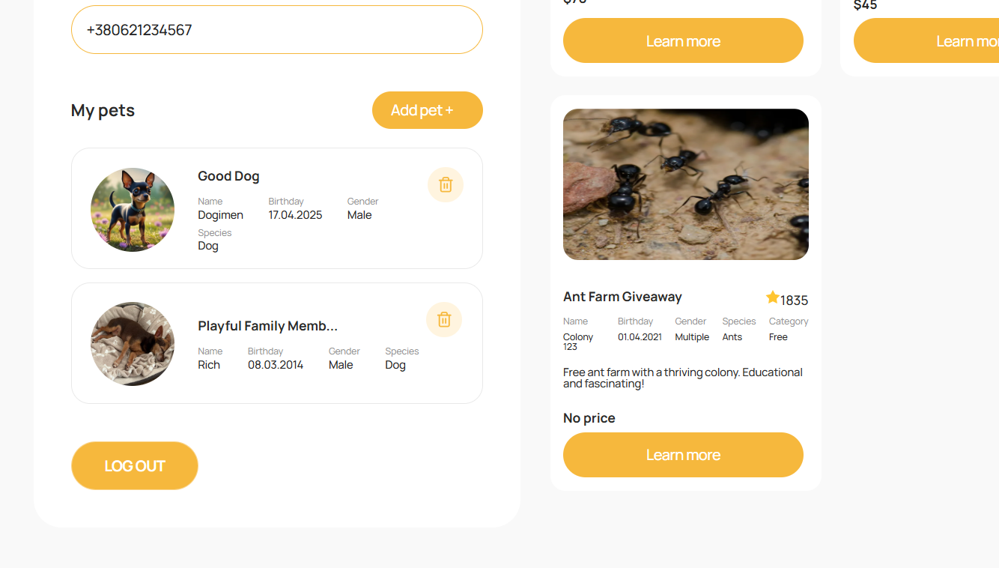

"PETLOVE" is a web application that helps people find, add and save pet listings. Users can browse pets, add them to favorites, track viewed cards and add their own pets.
To install the application, you need to copy the link from the github repository, as shown in the picture.

Click on the "Code" button in the drop-down window to copy the link. Go to the folder where you want to install the application, right-click to open the context menu and select open "Show advanced options" and select "Open Git Bash here" the terminal will open and enter the command "git clone https://github.com/Evgeniy-Galushko/petlove.git" and paste the previously copied link from github and press "Enter" after copying all the files, go to "Visual Studio Code" or another code editor, open the folder where you copied all the files, run the command line in the editor, installing all the dependencies using the command "npm i" or "npm install" after installing the dependencies, run the live page using the command "npm run dev". When you log in, the first page will be a picture of an animal and the site logo, when you click on it, the "Progress Bar" will appear when fully loaded, redirecting to the "home" page, where at the top is a navigation bar with a logo (when you click on it, you return to the "home" page), then there are navigation buttons "News", "Find pet", "Our friends" when you click on them, redirecting to the corresponding pages. Next there are two buttons, the first "Log In" when you click on it, redirecting to a page with a form for entering a login and password, the second button "Registration" redirects to a page with a form for registering a new user. Below on the page is a greeting and a background image. When you log in to your account, the login and registration buttons disappear and the "Log out" button, username and icon appear. Clicking on the button logs you out of your account.

When you click on the "News" button, you get to the page of news in the world of animals and not only. There is also a search bar.

When you click on the "Find pet" button, you get to a page with a list of pets that you can buy, add to favorites, and read detailed information. There is also a filter on the page with which you can filter pets by popularity, gender, type, and location of the pet.

When you click on the “Our friends” button, you are taken to a page with a list of friends.

When you log in to your account or register, you are redirected to the user page, which is divided into two parts. On the left side of the page, at the top, there is a button with a pen for editing your data. Below is the user's photo, below is the name, email and phone number. Next is the "Add pet +" button, which, when clicked, opens a page for adding your pet, where you need to specify the gender of the animal, photo, short description, name, date of birth, type of animal. Next is a list of your pets. Under the list, there is a button to log out of the account. On the right side of the page is a list of favorite pets "My favorite pets" and a list of viewed "Viewed".

Technologies used to write the web app:
React + React Router
Redux Toolkit for state management
Axios for HTTP requests
React Hot Toast for notifications
CSS Modules for styling components
Deployed on Vercel

Link to layout: https://www.figma.com/design/puMNfZVg4YI8UZoJ1QiLLi/Petl%F0%9F%92%9Bve?node-id=55838-750&t=ZJhChUdaYJXGIMS2-0

Link to technical specifications: https://docs.google.com/spreadsheets/d/1DmQUeGZy_oaXN6yn69ORLzou1ZQRyTMlrAqPSit_clw/edit?gid=1134921873#gid=1134921873

Developer: Halushko Yevhen. email: yudginchik@gmail.com
